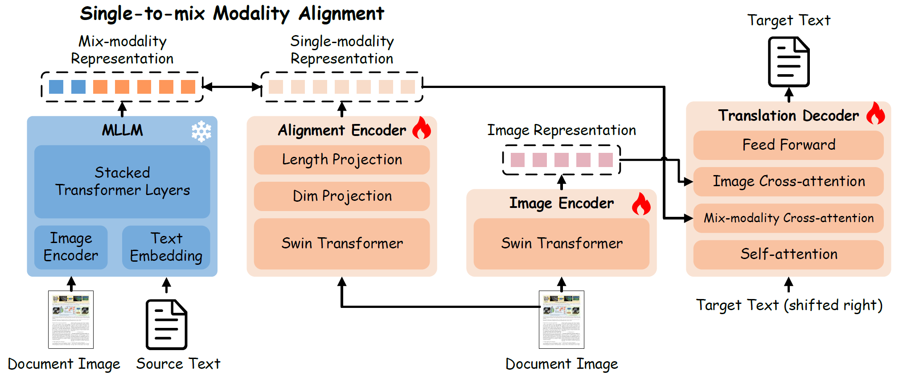

# Single-to-mix Modality Alignment with Multimodal Large Language Model for Document Image Machine Translation

This is the official repository for **MDoc** framework introduced by the following paper: [***Single-to-mix Modality Alignment with Multimodal Large Language Model for Document Image Machine Translation (ACL 2025 Main)***](https://aclanthology.org/2025.acl-long.606/)

## 📜 Abstract
Document Image Machine Translation (DIMT) aims to translate text within document images, facing generalization challenges due to limited training data and the complex interplay between visual and textual information.
To address these challenges, we introduce M4Doc, a novel single-to-mix modality alignment framework leveraging Multimodal Large Language Models (MLLMs).
M4Doc aligns an image-only encoder with the multimodal representations of an MLLM, pre-trained on large-scale document image datasets.
This alignment enables a lightweight DIMT model to learn crucial visual-textual correlations during training.
During inference, M4Doc bypasses the MLLM, maintaining computational efficiency while benefiting from its multimodal knowledge.
Comprehensive experiments demonstrate substantial improvements in translation quality, especially in cross-domain generalization and challenging document image scenarios.

**The diagram of the proposed M4Doc.**


## 🛠️ M4Doc
### 1. Requirements
Follow [Ucas-HaoranWei/Vary](https://github.com/Ucas-HaoranWei/Vary) to prepare the environment, then install the following packages.
```bash
sacrebleu==2.3.1
jieba==0.42.1
zss==1.2.0
```

### 2. Download pre-trained models and the dataset
Download Vary-base model from [Ucas-HaoranWei/Vary](https://github.com/Ucas-HaoranWei/Vary).

Download pre-trained Nougat model from [facebook/nougat-small](https://huggingface.co/facebook/nougat-small).

The DoTA dataset can be downloaded from this [huggingface link](https://huggingface.co/datasets/liangyupu/DoTA_dataset).
Please send an email to [liangyupu2021@ia.ac.cn](mailto:liangyupu2021@ia.ac.cn) to inform your name and affiliated institution after submitting the download application on Hugging Face.

The file directory structure is as follows:
```bash
DIMTDA
├── codes
├── DoTA_dataset
├── pretrained_models
└── utils
```

### 3. Pre-train a text translation model
```bash
bash pretrain_trans.sh
```

### 4. Finetune M4Doc
```bash
bash finetune_M4Doc.sh
```

### 5. Inference
Before running the script, you need to replace the `~/anaconda3/envs/your_env_name/lib/python3.10/site-packages/transformers/models/bert/modeling_bert.py` file with the `./utils/modeling_bert.py` file.
```bash
bash inference.sh
```

### 6. Evaluate
```bash
bash evaluate.sh
```

## 🙏🏻 Acknowledgement
We thank @lukas-blecher and [facebookresearch/nougat](https://github.com/facebookresearch/nougat) project for providing the pre-trained model.
We also thank [Ucas-HaoranWei/Vary](https://github.com/Ucas-HaoranWei/Vary) project for providing the pre-trained model.

## ✍🏻 Citation
If you want to cite our paper, please use the following BibTex entries:
```BibTex
@inproceedings{liang-etal-2025-single,
    title = "Single-to-mix Modality Alignment with Multimodal Large Language Model for Document Image Machine Translation",
    author = "Liang, Yupu  and
      Zhang, Yaping  and
      Zhang, Zhiyang  and
      Zhao, Yang  and
      Xiang, Lu  and
      Zong, Chengqing  and
      Zhou, Yu",
    editor = "Che, Wanxiang  and
      Nabende, Joyce  and
      Shutova, Ekaterina  and
      Pilehvar, Mohammad Taher",
    booktitle = "Proceedings of the 63rd Annual Meeting of the Association for Computational Linguistics (Volume 1: Long Papers)",
    month = jul,
    year = "2025",
    address = "Vienna, Austria",
    publisher = "Association for Computational Linguistics",
    url = "https://aclanthology.org/2025.acl-long.606/",
    pages = "12391--12408",
    ISBN = "979-8-89176-251-0",
}
```

If you have any question, feel free to contact [liangyupu2021@ia.ac.cn](mailto:liangyupu2021@ia.ac.cn).
